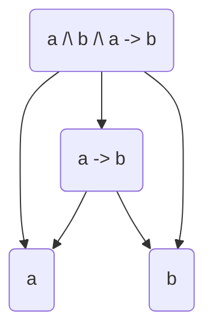
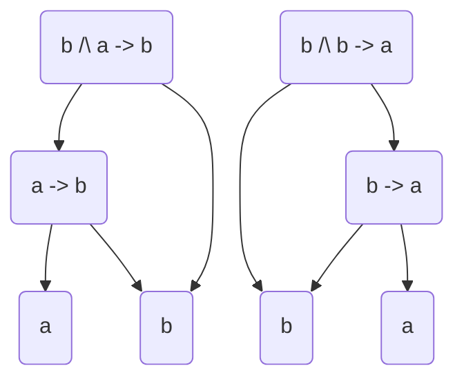
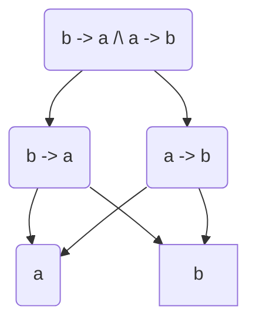

# Fast α-equivalence of intersection types
*Currently in progress*
---

## Usage
You can load `some.hs` in the ghci and call some functions in it.  
There is a function `alphaEqTy` which accepts two types in the specified
format (see definition for `Type` in code) and returns true if they are α-equivalent. This function is the baseline, it just goes through all the variants of reordering the names and see if types are equivalent in at least one of them.  
Another function `aEq` does the same but uses the technique specified below. For now it may not work on types with cyclic functions in them like `a -> b /\ b -> a`. But it should work on all types without such cycles.

## Technique
The main idea is that an intersection type is just a tree:  
Nodes is subtypes, including primitives types (like `a`). There is an edge between types if one type
 is somehow 'embedded' in the other. For example:



So to confirm $\alpha$-equivalence of two types 
we need to compare their graphs without looking at what letters are written in leafs (and any other node except for its type).  
The task of comparing two asymmetric graphs without cycles is NP-hard, but here we can define a special ordering on nodes and sort them. This will allow for fast comparing of two graphs.

Ordering routine is tricky and I don't know for sure if it's going to work in the end at all. But even if the technique below has a flaw, it at least would be a nice heuristic for $\alpha$-equivalence I guess.

The plan is to assign to each leaf type a depth-list, which stores all depths how you can get to this symbol. 
For example in the graph above `a` and `b` each has a depth list `[1, 2]`.  
Also because we have a function `a -> b` we can fix order of `a` and `b` such that $a < b$.  
Next say we got another type: `a /\ b /\ b -> a`. All we need to do is to compute depth lists of `a` and `b`, in this case it's 
`[1, 2]` for each of them again. But the ordering here will be $b < a$. Now we replace each symbol with it's depth-lists and compare this ordered depth-lists of two types. Here of course they are equal which means that types are $\alpha$-equivalent.

Consider another example:



Here the ordering for the first type is 
$a < b$, depth list for `a: [2]`, `b: [1, 2]`
for the second type the ordering is
$b < a$ and `b: [1, 2], a: [2]`
comparing depth-lists in order we get
```
[2] == [1, 2]
[1, 2] == [2]
```
which is not true, hence types are not $\alpha$-equivalent.

Of course this is only the beginning because
there are cases where we can not determine the
order of leaf types so easily. For example here:



we get cycles. To get rid of them, we need some deterministic way of removing edges in 
this cyclic graphs until there will be no cycles.  
*currently in progress*